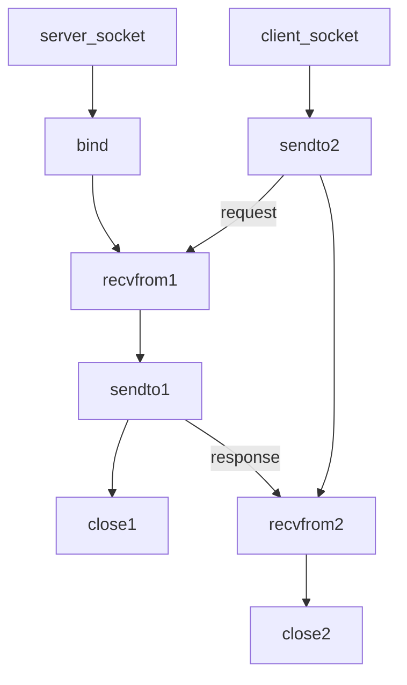

### 0. **笔记**

#### 带宽

**网络带宽：**

​	网络带宽指网络连接的速率或数据传输速率，通常以比特每秒（bps，bits per second）为单位。常见的单位包括：

- Kbps（千比特每秒）
- Mbps（兆比特每秒）
- Gbps（吉比特每秒）

**带宽类型：**

* **对称带宽**：上行带宽和下行带宽相等。某些企业级网络连接会提供对称的100 Mbps上传和下载带宽。

* **非对称带宽**：上行带宽和下行带宽不相等。家用宽带通常具有较高的下载带宽，但上传带宽较低，例如100 Mbps下载，10 Mbps上传。

#### 计算

1 Mbps（兆比特每秒）表示数据传输速率，但要转换为MB（兆字节），需要理解比特（bit）与字节（byte）之间的关系。

**关系**：

- 1 Byte = 8 bits

因此，要将 Mbps 转换为 MBps（兆字节每秒），可以使用以下公式：
$$
\text{MBps} = \frac{\text{Mbps}}{8}
$$

**计算**：

$$
1 \text{Mbps} = \frac{1}{8} \text{MBps} = 0.125 \text{MBps}
$$

**结论**：
$$
1 \text{Mbps} = 0.125 \text{MBps}
$$
也就是说，1 Mbps 的数据传输速率相当于每秒传输 0.125 MB 的数据。

#### bmon工具

`bmon: Bandwidth Monitor`, 监控网络带宽和性能工具，方便查看查看网络接口的实时流量、带宽利用率、数据包统计等信息

安装：`sudo apt-get install bmon`, 使用：`bmon`

#### UDP广播

UDP通信流程



使用UDP广播发现服务器

服务器端负责接收来自客户端的UDP数据包，计算并汇总带宽使用情况

客户端通过UDP广播来向指定网络段所有设备发送数据包，模拟实际网络流量

### 1. **设计思路**
- **服务器（Server）**：负责监听客户端的连接请求，并发送或接收数据以测试带宽。服务器会同时处理多个客户端的请求。
- **客户端（Client）**：每个客户端连接到服务器并执行带宽测试，上传或下载数据。
- **ncurses 界面**：用于显示服务器和客户端的实时状态、带宽统计、测试进度等信息。

了解多线程的方式，用epoll去写异步服务器端，客户端的话支持动态数据调整，要在服务器显示列表，发送指令进行上行下行，进行限速

扎实网络编程。传输的数据包大小最好是MTU的值，按字节统计。

### 2. **使用 ncurses 实现实时显示**
   - **界面布局**：
     
     - 顶部显示服务器状态（如连接的客户端数量、当前测试类型等）。
     - 中间区域显示每个客户端的实时带宽信息，包括上传和下载速度。
     - 底部显示操作提示或日志信息。
     
- **窗口刷新**：
     - 使用 `ncurses` 的 `refresh()` 函数刷新整个窗口，确保显示内容实时更新。
     - 为每个客户端创建一个独立的窗口或区域（如 `WINDOW` 对象），用来显示各自的带宽信息。可以通过 `wrefresh()` 函数刷新这些窗口。

- **多线程处理**：
     - 由于服务器需要同时处理多个客户端的连接，可以使用多线程或多进程来管理每个客户端的带宽测试。
     - 主线程负责处理 ncurses 界面的更新和整体逻辑，而每个客户端的连接可以由独立的线程处理带宽测试。
     - 使用线程间通信机制（如共享变量、消息队列）将带宽测试的实时数据传递给主线程，以便在 ncurses 界面上显示。

- **界面概要设计**：

  ```
  Server addr: 	192.168.166.100		port: 8888
  broadcast addr: 192.168.166.255		port: 5005
  test time:		500 sec			pakg size:	1400 bit
  mode: double 					limit: no limit
  
  pre		next 	set limit exit
  Connected device: 0	 	Run time: 0 	Page:0
  -----------------------------------------------------
  UP		0.00 Mbps 		DOWN 			0.00 Mbps
  
  Max bw: 	0.00 	| 	Max bw 		: 	0.00
  Min bw: 	0.00 	| 	Min bw 		: 	0.00
  Average bw:	0.00    |   Average bw  : 	0.00
  
  | RANK | IP 		    |PORT | UP 		| DOWN  	|
  |[ 1 ] | 192.168.166.20 |57676|9.93Mbps |9.93Mpbs   |
  .....
  ```

  连接列表 支持翻页

  共12个客户端，限速后实际速度与bmon监控的速度一致


### 3. **带宽测试逻辑**
   - **服务器**：
     - 监听特定端口，接受客户端连接。
     - 对每个连接，启动一个线程来处理数据传输并记录带宽信息。
     - 支持多种测试模式（如上传、下载、双向），通过命令或配置进行选择。
   - **客户端**：
     - 连接到服务器后，根据测试模式发送或接收数据包。
     - 实时计算传输速度，并将结果返回给服务器。

### 4. **实时更新与统计**
   - **实时带宽计算**：
     - 在每次数据传输时，计算传输的数据量并除以时间间隔，得出实时的带宽值。
     - 这些值会被频繁刷新，显示最新的网络状态。
   - **累积统计**：
     - 在每个连接结束后计算累计带宽、平均带宽等指标。
     - 在测试结束时，汇总所有客户端的测试结果并在 ncurses 界面上显示。

### 5. 代码架构

伪代码

```c
#include <ncurses.h>
#include <pthread.h>

void* handle_client(void* arg);
void update_ui();

int main() {
    // 初始化 ncurses
    initscr();
    cbreak();
    noecho();
    timeout(100); // 设置非阻塞输入

    // 主循环
    while (1) {
        // 更新界面
        update_ui();

        // 处理用户输入
        int ch = getch();
        if (ch == 'q') break; // 按 'q' 退出程序

        // 其他逻辑
    }

    // 关闭 ncurses
    endwin();
    return 0;
}

void update_ui() {
    // 清屏并更新客户端带宽信息
    clear();
    mvprintw(0, 0, "Server Running...");

    // 刷新界面
    refresh();
}

void* handle_client(void* arg) {
    // 客户端处理逻辑
    return NULL;
}
```

服务器

```c
#include <stdio.h>
#include <stdlib.h>
#include <string.h>
#include <unistd.h>
#include <pthread.h>
#include <ncurses.h>
#include <arpa/inet.h>

#define PORT 12345
#define BUF_SIZE 1024
#define MAX_CLIENTS 10

typedef struct
{
	int socket;
	struct sockaddr_in address;
	int id;
	double bandwidth;
	pthread_t thread; // 存储线程标识符
} Client;

Client clients[MAX_CLIENTS];
int client_count = 0;
pthread_mutex_t clients_mutex = PTHREAD_MUTEX_INITIALIZER;

void *handle_client(void *arg);
void update_ui();

int main()
{
	int server_socket;
	struct sockaddr_in server_addr;

	// 初始化 ncurses
	initscr();
	cbreak();
	noecho();
	timeout(100);

	// 创建服务器套接字
	server_socket = socket(AF_INET, SOCK_STREAM, 0);
	if (server_socket < 0)
	{
		perror("Socket creation failed");
		exit(EXIT_FAILURE);
	}

	// 设置服务器地址
	server_addr.sin_family = AF_INET;
	server_addr.sin_addr.s_addr = INADDR_ANY;
	server_addr.sin_port = htons(PORT);

	// 绑定套接字
	if (bind(server_socket, (struct sockaddr *)&server_addr, sizeof(server_addr)) < 0)
	{
		perror("Bind failed");
		close(server_socket);
		exit(EXIT_FAILURE);
	}

	// 监听连接
	if (listen(server_socket, MAX_CLIENTS) < 0)
	{
		perror("Listen failed");
		close(server_socket);
		exit(EXIT_FAILURE);
	}

	// 主循环，等待客户端连接
	while (1)
	{
		struct sockaddr_in client_addr;
		socklen_t client_len = sizeof(client_addr);
		int client_socket = accept(server_socket, (struct sockaddr *)&client_addr, &client_len);

		if (client_socket < 0)
		{
			perror("Accept failed");
			continue;
		}

		// 创建客户端处理线程
		pthread_mutex_lock(&clients_mutex);
		if (client_count < MAX_CLIENTS)
		{
			clients[client_count].socket = client_socket;
			clients[client_count].address = client_addr;
			clients[client_count].id = client_count;
			clients[client_count].bandwidth = 0.0;
			pthread_create(&clients[client_count].thread, NULL, handle_client, &clients[client_count]);
			client_count++;
		}
		else
		{
			close(client_socket);
		}
		pthread_mutex_unlock(&clients_mutex);

		// 更新界面
		update_ui();
	}

	// 关闭 ncurses
	endwin();
	close(server_socket);
	return 0;
}

void *handle_client(void *arg)
{
	Client *client = (Client *)arg;
	char buffer[BUF_SIZE];
	ssize_t bytes_received;
	double total_bytes = 0;
	time_t start_time, end_time;

	// 获取开始时间
	time(&start_time);

	// 处理数据传输
	while ((bytes_received = recv(client->socket, buffer, BUF_SIZE, 0)) > 0)
	{
		total_bytes += bytes_received;
		time(&end_time);
		double duration = difftime(end_time, start_time);

		// 计算带宽 (MB/s)
		pthread_mutex_lock(&clients_mutex);
		client->bandwidth = (total_bytes / 1024.0 / 1024.0) / duration;
		pthread_mutex_unlock(&clients_mutex);

		// 更新界面
		update_ui();
	}

	// 关闭客户端连接
	close(client->socket);

	// 从客户端列表中删除
	pthread_mutex_lock(&clients_mutex);
	client_count--;
	pthread_mutex_unlock(&clients_mutex);

	pthread_exit(NULL);
}

void update_ui()
{
	clear();
	mvprintw(0, 0, "Server Running...");
	mvprintw(1, 0, "Connected clients: %d", client_count);

	// 显示每个客户端的带宽
	pthread_mutex_lock(&clients_mutex);
	for (int i = 0; i < client_count; i++)
	{
		mvprintw(3 + i, 0, "Client %d - Bandwidth: %.2f MB/s", clients[i].id, clients[i].bandwidth);
	}
	pthread_mutex_unlock(&clients_mutex);

	refresh();
}
```

客户端

```c
#include <stdio.h>
#include <stdlib.h>
#include <string.h>
#include <unistd.h>
#include <arpa/inet.h>

#define SERVER_IP "127.0.0.1"
#define PORT 12345
#define BUF_SIZE 1024

int main()
{
	int sock;
	struct sockaddr_in server_addr;
	char buffer[BUF_SIZE];

	// 创建套接字
	sock = socket(AF_INET, SOCK_STREAM, 0);
	if (sock < 0)
	{
		perror("Socket creation failed");
		exit(EXIT_FAILURE);
	}

	// 设置服务器地址
	server_addr.sin_family = AF_INET;
	server_addr.sin_port = htons(PORT);
	if (inet_pton(AF_INET, SERVER_IP, &server_addr.sin_addr) <= 0)
	{
		perror("Invalid address");
		close(sock);
		exit(EXIT_FAILURE);
	}

	// 连接服务器
	if (connect(sock, (struct sockaddr *)&server_addr, sizeof(server_addr)) < 0)
	{
		perror("Connection failed");
		close(sock);
		exit(EXIT_FAILURE);
	}

	// 发送数据
	while (1)
	{
		memset(buffer, 'A', BUF_SIZE);
		if (send(sock, buffer, BUF_SIZE, 0) < 0)
		{
			perror("Send failed");
			break;
		}
		usleep(10000); // 模拟带宽限制，调整此值控制速度
	}

	// 关闭连接
	close(sock);
	return 0;
}
```

编译

```bash
gcc -o server server.c -lpthread -lncurses
gcc -o client client.c
```

运行

```bash
./server
./client (打开多个)
```

