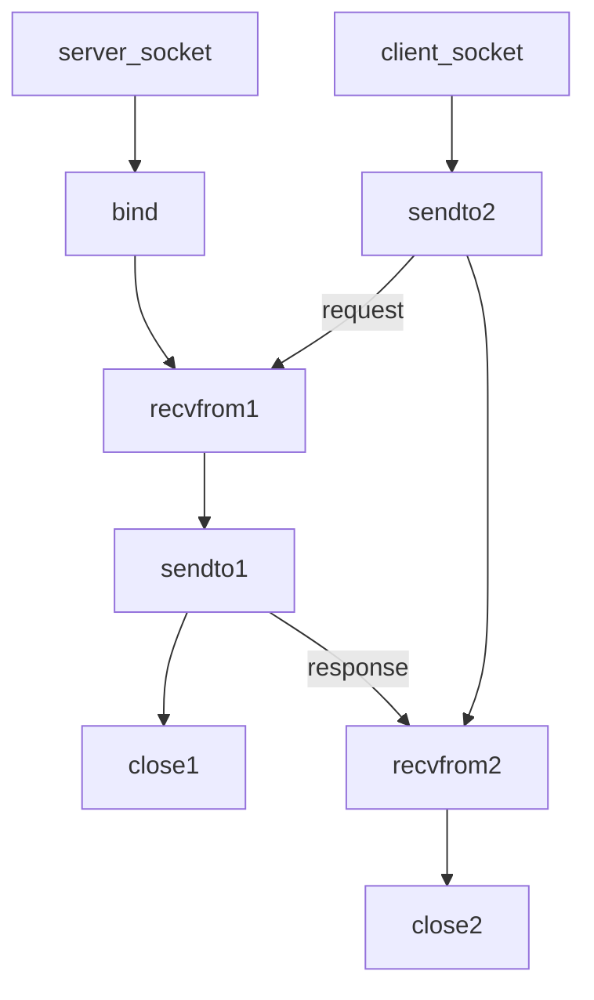

socket套接字

**创建socket**

socket创建在内核中，创建成功返回核文件描述表中的socket描述符

实际上就是结构体，封装有很多成员

```c
#include <sys/socket.h>

int socket(int domain, int type, int protocol)
// 创建一个套接字
// 返回：成功 返回描述符可以操作内核的某一块内存，网络通信基于这个文件描述符来完成。出错 返回-1
    
// 将文件描述符和本地的IP与端口进行绑定   
int bind(int sockfd, const struct sockaddr *addr, socklen_t addrlen);

// 给监听的套接字设置监听
int listen(int sockfd, int backlog);

// 等待并接受客户端的连接请求, 建立新的连接, 会得到一个新的文件描述符(通信的)		
int accept(int sockfd, struct sockaddr *addr, socklen_t *addrlen);

// 接收数据
ssize_t read(int sockfd, void *buf, size_t size);
ssize_t recv(int sockfd, void *buf, size_t size, int flags);

// 发送数据的函数
ssize_t write(int fd, const void *buf, size_t len);
ssize_t send(int fd, const void *buf, size_t len, int flags);

// 成功连接服务器之后, 客户端会自动随机绑定一个端口
// 服务器端调用accept()的函数, 第二个参数存储的就是客户端的IP和端口信息
int connect(int sockfd, const struct sockaddr *addr, socklen_t addrlen);
```

**int socket参数**

* domain
  - AF_INET     IPv4
  - AF_INET6   IPv6
  - AF_UNIX     unix域
  - AF_UNSPEC 未指定

* protocol
  * 一般为 0，表示按给定的域和套接字类型选择默认协议

* type
  * SOCK_STREAM 	 TCP
  * SOCK_DGRAM  	 UDP
  * SOCK_RAW                IP\ICMP
  * SOCK_SEQPACKET   长度固定、有序、可靠的面向链接报文传递

**文件描述符对应的内存结构：**

一个文件文件描述符对应两块内存, 一块内存是读缓冲区, 一块内存是写缓冲区
读数据: 通过文件描述符将内存中的数据读出, 这块内存称之为读缓冲区
写数据: 通过文件描述符将数据写入到某块内存中, 这块内存称之为写缓冲区

**函数**

```c
// 这套api主要用于 网络通信过程中 IP 和 端口 的 转换
// 将一个短整形从主机字节序 -> 网络字节序
uint16_t htons(uint16_t hostshort);	
// 将一个整形从主机字节序 -> 网络字节序
uint32_t htonl(uint32_t hostlong);	
// 将一个短整形从网络字节序 -> 主机字节序
uint16_t ntohs(uint16_t netshort)
// 将一个整形从网络字节序 -> 主机字节序
uint32_t ntohl(uint32_t netlong);
```

**sockaddr数据结构**

```c
// 在写数据的时候不好用
struct sockaddr {
	sa_family_t sa_family;       // 地址族协议, ipv4
	char        sa_data[14];     // 端口(2字节) + IP地址(4字节) + 填充(8字节)
}

typedef unsigned short  uint16_t;
typedef unsigned int    uint32_t;
typedef uint16_t in_port_t;
typedef uint32_t in_addr_t;
typedef unsigned short int sa_family_t;
#define __SOCKADDR_COMMON_SIZE (sizeof (unsigned short int))

struct in_addr
{
    in_addr_t s_addr;
};  

// sizeof(struct sockaddr) == sizeof(struct sockaddr_in)
struct sockaddr_in
{
    sa_family_t sin_family;		/* 地址族协议: AF_INET */
    in_port_t sin_port;         /* 端口, 2字节-> 大端  */
    struct in_addr sin_addr;    /* IP地址, 4字节 -> 大端  */
    /* 填充 8字节 */
    unsigned char sin_zero[sizeof (struct sockaddr) - sizeof(sin_family) -
               sizeof (in_port_t) - sizeof (struct in_addr)];
}; 
```

#### TCP通信流程

面向连接、安全的流式传输协议

面向连接：是一个双向连接，通过三次握手完成，断开连接需要通过四次挥手完成。
安全：tcp通信过程中，会对发送的每一数据包都会进行校验, 如果发现数据丢失, 会自动重传
流式传输：发送端和接收端处理数据的速度，数据的量都可以不一致

**在tcp的服务器端, 有两类文件描述符**

* 监听的文件描述符
  只需要有一个
  不负责和客户端通信, 负责检测客户端的连接请求, 检测到之后调用accept就可以建立新的连接

* 通信的文件描述符
  负责和建立连接的客户端通信
  如果有N个客户端和服务器建立了新的连接, 通信的文件描述符就有N个，每个客户端和服务器都对应一个通信的文件描述符

**TCP服务器端通信流程**

`socket() -> bind() -> listen() -> accept() -> read()/write() -> close()`

其中读写操作默认都是堵塞的

**TCP客户端通信流程**

`socket() -> connect() -> read()/recv() -> close()`

#### UDP通信流程

udp是一个面向无连接的，不安全的，报式传输层协议，udp的通信过程默认也是阻塞的。

* UDP通信不需要建立连接 ，因此不需要进行connect()操作

* UDP通信过程中，每次都需要指定数据接收端的IP和端口，和发快递差不多

* UDP不对收到的数据进行排序，在UDP报文的首部中并没有关于数据顺序的信息

* UDP对接收到的数据报不回复确认信息，发送端不知道数据是否被正确接收，也不会重发数据。

* 如果发生了数据丢失，不存在丢一半的情况，如果丢当前这个数据包就全部丢失了

**server端**`socket() -> bind() -> recvfrom() -> sendto() -> close()`

**client端**`socket() -> sendto() -> recvfrom() -> close()`




#### UDP广播

使用UDP广播发现服务器

服务器端负责接收来自客户端的UDP数据包，计算并汇总带宽使用情况

客户端通过UDP广播来向指定网络段所有设备发送数据包，模拟实际网络流量

**通过广播可以向子网中多台计算机发送消息，并且子网中所有的计算机都可以接收到发送方发送的消息**

广播分为两端，即数据发送端和数据接收端，通过广播的方式发送数据，发送端和接收端的关系是 1:N

* 发送广播消息的一端，通过广播地址，可以将消息同时发送到局域网的多台主机上（数据接收端）

* 在发送广播消息的时候，必须要把数据发送到广播地址上

* 广播只能在局域网内使用，广域网是无法使用UDP进行广播的

* 只要发送端在发送广播消息，数据接收端就能收到广播消息，消息的接收是无法拒绝的，除非将接收端的进程关闭，就接收不到了

UDP的广播和日常生活中的广播是一样的，都是一种快速传播消息的方式，因此广播的开销很小，发送端使用一个广播地址，就可以将数据发送到多个接收数据的终端上，如果不使用广播，就需要进行多次发送才能将数据分别发送到不同的主机上

#### 文件描述符

（File Descriptor, FD）是一个用于标识打开文件或网络连接的整数。监听的文件描述符和通信的文件描述符是两种不同的文件描述符，通常用于服务器端网络编程中。在tcp的服务端，有两类文件描述符

**监听的文件描述符**

监听的文件描述符是服务器程序用于接收新连接请求的文件描述符。它通常通过调用 `socket()` 函数创建，然后通过 `bind()` 函数绑定到一个特定的IP地址和端口，接着调用 `listen()` 函数开始监听连接请求。

- **作用**：监听文件描述符的作用是等待来自客户端的连接请求。
- **使用**：当有新的连接请求到达时，可以使用 `accept()` 函数接收连接请求并返回一个新的文件描述符，这个新的文件描述符就是通信的文件描述符。

**通信的文件描述符**

通信的文件描述符是用于实际数据传输的文件描述符。每当 `accept()` 成功接受一个连接请求时，服务器就会生成一个新的通信文件描述符，这个描述符专门用于与特定客户端之间的数据交换。

- **作用**：通信文件描述符用于与客户端进行数据的收发操作。每个客户端与服务器的连接都会有一个独立的通信文件描述符。
- **使用**：通过这个文件描述符，可以使用 `send()`、`recv()` 等函数与客户端进行通信。

#### 示例：

```c
int listen_fd, conn_fd;

// 创建监听文件描述符
listen_fd = socket(AF_INET, SOCK_STREAM, 0);

// 绑定地址和端口
bind(listen_fd, (struct sockaddr*)&server_addr, sizeof(server_addr));

// 开始监听
listen(listen_fd, SOMAXCONN);

// 等待客户端连接
conn_fd = accept(listen_fd, (struct sockaddr*)&client_addr, &client_len);

// 通过 conn_fd 与客户端通信
recv(conn_fd, buffer, sizeof(buffer), 0);
```

在这个示例中，`listen_fd` 是监听文件描述符，它用于监听新的连接请求。`conn_fd` 是通信文件描述符，用于与某个客户端进行实际的数据传输。

#### TCP通信实例

server

```c
#include <stdio.h>
#include <stdlib.h>
#include <string.h>
#include <unistd.h>
#include <arpa/inet.h>

int main()
{
	int lfd = socket(AF_INET, SOCK_STREAM, 0);
	if (lfd == -1)
	{
		perror("socket");
		exit(0);
	}

	struct sockaddr_in addr;
	addr.sin_family = AF_INET;
	addr.sin_port = htons(10000);
	addr.sin_addr.s_addr = INADDR_ANY;

	int ret = bind(lfd, (struct sockaddr *)&addr, sizeof(addr));
	if (ret == -1)
	{
		perror("bind");
		exit(0);
	}

	ret = listen(lfd, 128);
	if (ret == -1)
	{
		perror("listen");
		exit(0);
	}

	struct sockaddr_in client_addr;
	int client_len = sizeof(client_addr);
	int cfd = accept(lfd, (struct sockaddr *)&client_addr, &client_len);
	if (cfd == -1)
	{
		perror("accept");
		exit(0);
	}

	char ip[24] = {0};
	printf("client ip: %s, port: %d\n",
		   inet_ntop(AF_INET, &client_addr.sin_addr, ip, sizeof(ip)),
		   ntohs(client_addr.sin_port));

	while (1)
	{
		char buf[1024] = {0};
		memset(buf, 0, sizeof(buf));
		int len = read(cfd, buf, sizeof(buf));

		if (len > 0)
		{
			printf("recv: %s\n", buf);
			write(cfd, buf, len);
		}
		else if (len = 0)
		{
			printf("client close\n");
			break;
		}
		else
		{
			perror("read");
			break;
		}
	}
	close(cfd);
	close(lfd);
	return 0;
}
```

client

```c
#include <stdio.h>
#include <stdlib.h>
#include <string.h>
#include <unistd.h>
#include <arpa/inet.h>

int main()
{
	int fd = socket(AF_INET, SOCK_STREAM, 0);
	if (fd < 0)
	{
		perror("socket");
		exit(0);
	}
struct sockaddr_in addr;
addr.sin_family = AF_INET;
addr.sin_port = htons(10000);
inet_pton(AF_INET, "127.0.0.1", &addr.sin_addr);

int ret = connect(fd, (struct sockaddr *)&addr, sizeof(addr));
if (ret < 0)
{
	perror("connect");
	exit(0);
}
int number = 0;
while (1)
{
	char buf[1024];
	sprintf(buf, "Hello, I am client %d\n", number++);
	write(fd, buf, strlen(buf) + 1);

	memset(buf, 0, sizeof(buf));
	int len = read(fd, buf, sizeof(buf));
	if (len > 0)
	{
		printf("Server: %s\n", buf);
	}
	else if (len == 0)
	{
		printf("Server closed the connection\n");
		break;
	}
	else
	{
		perror("read");
		break;
	}
	sleep(1);
}
close(fd);
return 0;
}
```

上面的代码中有三个函数`accept() read() write()`引起程序堵塞，被`accept`阻塞就无法通信，被`read`阻塞就无法和客户端建立新连接，因此在单线程或者单进程场景下服务器无法处理多连接，这种情况一般用到多线程+IO多路复用

#### 多线程并发设计思路

主线程子线程分别在服务器端处理监听和通信流程

* 主线程

  * 负责监听，处理客户端连接请求，在父进程中循环调用`accept()`函数

  * 创建子线程，让这个子线程和对应的客户端通信

  * 线程分离回收子线程资源

* 子线程：负责通信，基于主线程建立新连接之后得到的文件描述符，和对应的客户端完成数据的接收和发送
  * 发送数据`send() / write()`
  * 接收数据`recv() / read()`

多线程服务器端程序中，多个线程共用同一个地址空间，数据有独占和共享之分

* 同一个地址空间中多个线程的栈空间是独占的
* 多个线程共享全局数据区，堆区，以及内核区的文件描述符等资源，因此需要注意数据覆盖问题，并且在多个线程访问共享资源的时候，还需要进行线程同步

```c
#include <stdio.h>
#include <stdlib.h>
#include <unistd.h>
#include <string.h>
#include <arpa/inet.h>
#include <pthread.h>

struct SockInfo
{
    int fd;                      // 通信
    pthread_t tid;               // 线程ID
    struct sockaddr_in addr;     // 地址信息
};

struct SockInfo infos[128];

void* working(void* arg)
{
    while(1)
    {
        struct SockInfo* info = (struct SockInfo*)arg;
        // 接收数据
        char buf[1024];
        int ret = read(info->fd, buf, sizeof(buf));
        if(ret == 0)
        {
            printf("客户端已经关闭连接...\n");
            info->fd = -1;
            break;
        }
        else if(ret == -1)
        {
            printf("接收数据失败...\n");
            info->fd = -1;
            break;
        }
        else
        {
            write(info->fd, buf, strlen(buf)+1);
        }
    }
    return NULL;
}

int main()
{
    // 1. 创建用于监听的套接字
    int fd = socket(AF_INET, SOCK_STREAM, 0);
    if(fd == -1)
    {
        perror("socket");
        exit(0);
    }

    // 2. 绑定
    struct sockaddr_in addr;
    addr.sin_family = AF_INET;          // ipv4
    addr.sin_port = htons(8989);        // 字节序应该是网络字节序
    addr.sin_addr.s_addr =  INADDR_ANY; // == 0, 获取IP的操作交给了内核
    int ret = bind(fd, (struct sockaddr*)&addr, sizeof(addr));
    if(ret == -1)
    {
        perror("bind");
        exit(0);
    }

    // 3.设置监听
    ret = listen(fd, 100);
    if(ret == -1)
    {
        perror("listen");
        exit(0);
    }

    // 4. 等待, 接受连接请求
    int len = sizeof(struct sockaddr);

    // 数据初始化
    int max = sizeof(infos) / sizeof(infos[0]);
    for(int i=0; i<max; ++i)
    {
        bzero(&infos[i], sizeof(infos[i]));
        infos[i].fd = -1;
        infos[i].tid = -1;
    }

    // 父进程监听, 子进程通信
    while(1)
    {
        // 创建子线程
        struct SockInfo* pinfo;
        for(int i=0; i<max; ++i)
        {
            if(infos[i].fd == -1)
            {
                pinfo = &infos[i];
                break;
            }
            if(i == max-1)
            {
                sleep(1);
                i--;
            }
        }

        int connfd = accept(fd, (struct sockaddr*)&pinfo->addr, &len);
        printf("parent thread, connfd: %d\n", connfd);
        if(connfd == -1)
        {
            perror("accept");
            exit(0);
        }
        pinfo->fd = connfd;
        pthread_create(&pinfo->tid, NULL, working, pinfo);
        pthread_detach(pinfo->tid);
    }

    // 释放资源
    close(fd);  // 监听

    return 0;
}
```

在编写多线程版并发服务器代码的时候，需要注意父子线程共用同一个地址空间中的文件描述符，因此每当在主线程中建立一个新的连接，都需要**将得到文件描述符值保存**起来，不能在同一变量上进行覆盖，这样做丢失了之前的文件描述符值也就不知道怎么和客户端通信

在上面示例代码中是将成功建立连接之后得到的用于通信的文件描述符值保存到了一个全局数组中，每个子线程需要和不同的客户端通信，需要的文件描述符值也就不一样，只要保证存储每个有效文件描述符值的变量对应不同的内存地址，在使用的时候就不会发生数据覆盖的现象，造成通信数据的混乱[爱编程的大丙](https://subingwen.cn/linux/concurrence/#3-%E5%A4%9A%E7%BA%BF%E7%A8%8B%E5%B9%B6%E5%8F%91)
